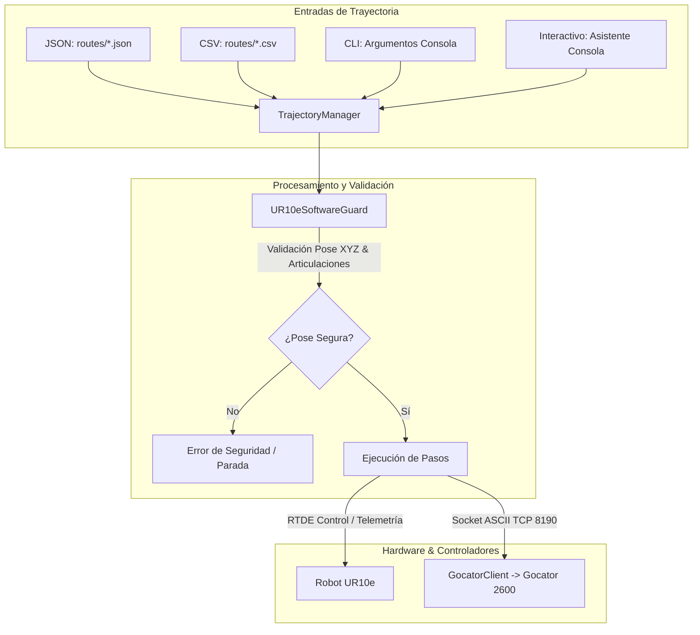

# Documentación Técnica de Cambios y Guía Integral de Uso
## Proyecto TFG: Escaneo de Perfilómetro Gocator 2600 y Robot UR10e

---

## 1. Resumen Ejecutivo y Objetivos

Este documento recoge la evolución técnica, arquitectónica y operativa del sistema de control del robot industrial **Universal Robots UR10e** y el sensor de perfilometría 3D **LMI Gocator 2600**.

### 1.1. Estado Previo vs. Estado Actual

| Aspecto | Estado Previo (Monolítico / Rígido) | Estado Actual (Modular / Paramétrico) |
| :--- | :--- | :--- |
| **Definición de Rutas** | Coordenadas articulares fijas incrustadas en código Python (*hardcoded*). | Desacoplado: soporte para **JSON**, **CSV**, **CLI** y **Asistente Interactivo**. |
| **Tipos de Movimiento** | Únicamente trayectorias lineales cartesianas (`moveL`) de un único tramo. | Soporte combinado de movimientos **lineales (`moveL`)** y **circulares (`moveC`)** multi-paso. |
| **Sistemas de Coordenadas** | Ángulos en grados convertidos a radianes de forma manual. | Conversión automática entre **grados articulares**, **radianes articulares** y **poses cartesianas TCP [x, y, z, rx, ry, rz]**. |
| **Seguridad Espacial** | Solo igualación Z en destino; sin validación de límites espaciales ni de articulación. | **`UR10eSoftwareGuard`**: comprobación de caja de seguridad (envolvente 3D), límites de rotación y monitoreo de paradas de protección y emergencia. |
| **Sincronización con Sensor** | Ventana fija de tiempo o disparo único; conexión directa por socket efímero sin manejo de excepciones. | **`GocatorClient`** orientado a objetos: gestión de ciclos de vida, disparo por software (`trigger`), verificación de conexión y parada de emergencia del láser en bloques `finally`. |
| **Ciclo de Desarrollo** | Necesidad de reconstruir imágenes Docker ante cualquier cambio en el código. | Volúmenes montados en `docker-compose.yml` (`./src` y `./routes`), permitiendo ejecución inmediata sin recompilación. |
| **Pruebas y Simulación** | No existía modo de prueba sin robot físico ni tests unitarios. | Modo simulación `--dry-run` en todos los módulos y suite de tests unitarios automatizados (`unittest`). |

---

## 2. Arquitectura del Sistema y Registro Detallado de Cambios



### 2.1. Módulo de Seguridad Espacial y Cinemática: `src/robot_guard.py`
*   **Clase `UR10eSoftwareGuard`**:
    *   **Envolvente de Trabajo Segura (Workspace Bounds):** Define una caja 3D en el espacio cartesiano del robot (por defecto $X \in [-1.2, 1.2]\,\text{m}$, $Y \in [-1.2, 1.2]\,\text{m}$, $Z \in [-0.2, 1.2]\,\text{m}$). Previene que el cabezal o el sensor impacten contra la mesa o desciendan a zonas prohibidas.
    *   **Validación Articular:** Verifica que ninguna de las 6 juntas sobrepase el rango físico admisible ($\pm 2\pi\,\text{rad}$ con tolerancia de seguridad).
    *   **Monitorización en Tiempo Real de Paradas:** Mediante la interfaz de telemetría RTDE, consulta preventivamente si el robot se encuentra en parada de protección (`isProtectiveStopped`) o si la seta de emergencia está presionada (`isEmergencyStopped`).

### 2.2. Gestor y Normalizador de Trayectorias: `src/trajectory_manager.py`
*   **Estructuras de Datos (`@dataclass`)**:
    *   `TrajectoryStep`: Modela cada etapa del movimiento con identificador, nombre, tipo de movimiento (`lineal` o `circular`), sistema de coordenadas (`articulares_deg`, `articulares_rad`, `cartesianas`), punto destino, origen opcional, punto vía (`via` para curvas), bandera booleana de escaneo (`scan`), velocidad, aceleración, radio de mezcla (`blend_radius`) y modo de orientación.
    *   `TrajectoryRoute`: Agrupa la secuencia de pasos con parámetros globales, descripción y restricción de altura ($Z$ constante).
*   **Cargadores de Rutas**:
    *   `from_json(path_or_str)`: Parsea y valida archivos o cadenas JSON.
    *   `from_csv(path)`: Parsea archivos tabulares CSV, facilitando la creación de secuencias en Excel o LibreOffice.
    *   `from_cli(args)`: Convierte argumentos recibidos directamente por línea de comandos en una trayectoria ejecutable.
    *   `from_interactive()`: Ofrece un menú paso a paso en consola para configurar movimientos sobre la marcha.
    *   `get_default_tfg_route()`: Proporciona la ruta canónica de referencia del TFG para mantener retrocompatibilidad total.
*   **Cálculo de Lead-in / Lead-out (`calcular_puntos_leadin`)**:
    *   Calcula de forma vectorial los puntos extendidos antes del inicio y después del final de una recta de barrido. Esto permite al robot alcanzar la velocidad crucero antes de encender el láser y desacelerar tras haber finalizado el tramo de interés, garantizando una densidad de nube de puntos homogénea.
*   **Cinemática Directa y Normalización Cartesiana**:
    *   Integra `rtde_ctrl.getForwardKinematics()` para convertir automáticamente ángulos articulares a poses cartesianas del TCP.

### 2.3. Cliente de Comunicación Gocator: `src/gocator.py`
*   **Refactorización a Programación Orientada a Objetos (`GocatorClient`)**:
    *   Encapsula la comunicación por socket TCP/IP con el puerto ASCII 8190 de GoPxL.
    *   Métodos especializados:
        *   `start()`: Envía el comando `start\r\n` para encender el láser y comenzar el muestreo.
        *   `stop()`: Envía `stop\r\n` para apagar el láser y finalizar la captura.
        *   `trigger()`: En modo Surface / Software Trigger, envía la señal de disparo para registrar el volumen 3D.
        *   `is_available()`: Comprueba la disponibilidad del sensor mediante un socket no bloqueante con timeout reducido.
    *   Conserva la función `enviar_comando_ascii()` para asegurar compatibilidad con scripts existentes.

### 2.4. Telemetría y Diagnóstico: `src/robot_status.py`
*   Añadido soporte para argumentos CLI:
    *   `--json`: Emite el estado del robot en formato estructurado JSON estándar para integración con pipelines o dashboards.
    *   `--dry-run`: Genera telemetría simulada para pruebas de software en máquinas sin conexión con el brazo robótico.
*   Lectura ampliada de telemetría:
    *   Inspección de flags de parada de protección y parada de emergencia.
    *   Lectura de temperaturas individuales de las 6 juntas (`getJointTemperatures()`).

### 2.5. Movimiento Autónomo: `src/robot_movement.py`
*   Sustitución de la trayectoria estática anterior por el motor dinámico de `TrajectoryManager`.
*   Integración de `UR10eSoftwareGuard` antes de ejecutar cada instrucción cinemática (`moveL` o `moveC`).
*   Bloques de finalización `finally` robustecidos para garantizar la llamada a `stopScript()` y desconexión limpia de sockets RTDE ante cualquier interrupción (`Ctrl+C` o error de software).
*   Soporte completo de los modos `--json`, `--csv`, `--modo cli`, `--interactivo` y `--dry-run`.

### 2.6. Sincronización Robot-Perfilómetro: `src/scan_sync.py`
*   **Coordinación Paso a Paso**:
    *   Cada paso de la trayectoria decide de forma autónoma si requiere activación del perfilómetro (`step.scan = True`).
    *   En pasos con escaneo activo:
        1. Reposiciona en origen (si está configurado) con el láser apagado.
        2. Activa el sensor (`start`) y envía el `trigger`.
        3. Ejecuta el barrido cinemático (`moveL` o `moveC`).
        4. Apaga el láser inmediatamente al completar el tramo (`stop`).
*   **Parada Preventiva de Emergencia**:
    *   Si se produce cualquier excepción durante el barrido (colisión, error cinemático, aborto de usuario), el bloque `except` captura el evento y envía una señal `stop` inmediata al perfilómetro para garantizar que el láser nunca quede encendido accidentalmente.
*   Soporte para modo simulación `--dry-run`.

### 2.7. Infraestructura y Pruebas Automatizadas
*   `docker-compose.yml`:
    *   Añadido montaje de volúmenes de desarrollo:
        ```yaml
        volumes:
          - ./src:/app/src
          - ./routes:/app/routes
        ```
    *   Permite modificar scripts o añadir nuevas rutas JSON/CSV sin requerir `docker compose build`.
*   `tests/test_trajectory_manager.py`:
    *   Suite con 6 pruebas unitarias (`TestTrajectoryManager`):
        1. `test_default_tfg_route`: Comprueba la integridad de la ruta por defecto del TFG.
        2. `test_parse_default_json`: Valida el parseo de esquemas JSON estándar.
        3. `test_parse_mixta_json`: Valida el soporte de movimientos circulares y tramos mixtos.
        4. `test_parse_csv`: Valida la carga tabular de rutas desde archivos CSV.
        5. `test_leadin_calculation`: Verifica el cálculo vectorial de los puntos de aceleración previa.
        6. `test_software_guard_bounds`: Valida que el guardarraíl de software rechace puntos fuera de los límites espaciales.

---

## 3. Guía Integral de Uso

### 3.1. Requisitos Previos y Configuración de Red

El sistema utiliza variables de entorno para configurar las direcciones IP y puertos de los dispositivos. Cree un archivo `.env` en la raíz del proyecto (este archivo está ignorado en Git por motivos de seguridad):

```ini
# Configuración del Robot UR10e
ROBOT_IP=192.168.0.210

# Configuración del Perfilómetro Gocator 2600
GOCATOR_IP=192.168.1.10
GOCATOR_PORT=8190

# Configuración Operativa
SWEEP_TIME=30
```

> [!IMPORTANT]
> Verifique que la tarjeta de red de su ordenador esté configurada en el mismo rango de subred que los dispositivos físicos (o disponga de interfaces dedicadas para cada equipo).

---

### 3.2. Diagnóstico del Robot (`robot_status.py`)

Antes de realizar movimientos, verifique el estado del brazo y asegúrese de que no haya paradas de seguridad activas.

#### Ejecución con Docker:
```bash
# Diagnóstico estándar por consola
docker compose run status

# Salida en formato JSON estructurado
docker compose run status python src/robot_status.py --json
```

#### Ejecución en Entorno Local:
```bash
# Diagnóstico físico
python src/robot_status.py

# Diagnóstico simulado (sin hardware conectado)
python src/robot_status.py --dry-run
```

---

### 3.3. Control Individual del Sensor Gocator (`gocator.py`)

Para realizar pruebas independientes de encendido del láser y comprobar la comunicación TCP/IP con GoPxL:

```bash
# Con Docker Compose (mantiene el láser encendido durante SWEEP_TIME segundos)
docker compose run gocator

# En entorno local con Python
python src/gocator.py
```

---

### 3.4. Ejecución de Movimientos Sin Sensor (`robot_movement.py`)

Utilice este módulo para verificar físicamente que la trayectoria es segura antes de activar el perfilómetro láser.

#### 1. Trayectoria de Referencia TFG (Por Defecto):
```bash
docker compose run movement
```

#### 2. Carga de Trayectoria desde Archivo JSON:
```bash
docker compose run movement python src/robot_movement.py --json routes/ejemplo_ruta_mixta.json
```

#### 3. Carga de Trayectoria desde Archivo CSV:
```bash
docker compose run movement python src/robot_movement.py --csv routes/ejemplo_ruta.csv
```

#### 4. Modo Simulación (Dry-Run):
Valida la trayectoria y las transformaciones cinemáticas sin enviar comandos al brazo:
```bash
docker compose run movement python src/robot_movement.py --dry-run --json routes/ejemplo_ruta_mixta.json
```

---

### 3.5. Escaneo Sincronizado (`scan_sync.py`) — Flujo Principal

Este es el comando principal de inspección. Coordina el movimiento cinemático con la captura 3D del perfilómetro.

#### Opción A: Trayectoria Canónica del TFG
Ejecuta la trayectoria horizontal plana de referencia (Origen $\rightarrow$ Fin con $Z$ constante):
```bash
docker compose run scan
```

#### Opción B: Carga desde Archivo JSON
Ideal para inspecciones multi-tramo con combinación de secciones lineales y arcos circulares:
```bash
docker compose run scan python src/scan_sync.py --json routes/ejemplo_ruta_mixta.json
```

#### Opción C: Carga desde Archivo CSV
Permite definir los puntos en hojas de cálculo como Excel:
```bash
docker compose run scan python src/scan_sync.py --csv routes/ejemplo_ruta.csv
```

#### Opción D: Movimiento Directo por Consola (CLI)
Permite enviar una trayectoria sin crear previamente un archivo:

```bash
# Ejemplo 1: Barrido lineal con coordenadas articulares en grados
docker compose run scan python src/scan_sync.py --modo cli --tipo-mov lineal \
    --coord-tipo articulares_deg \
    --origen 60 -118 -75 -75 89 149 \
    --destino 132 -108 -87 -72 90 220 \
    --escanear --velocidad 0.05

# Ejemplo 2: Arco circular con coordenadas cartesianas (TCP)
docker compose run scan python src/scan_sync.py --modo cli --tipo-mov circular \
    --coord-tipo cartesianas \
    --origen 0.40 -0.20 0.15 3.14 0 0 \
    --via 0.45 -0.18 0.15 3.14 0 0 \
    --destino 0.50 -0.15 0.15 3.14 0 0 \
    --escanear --velocidad 0.03
```

#### Opción E: Asistente Interactivo en Consola
El asistente solicita interactivamente al operador los parámetros deseados:
```bash
docker compose run scan python src/scan_sync.py --interactivo
```

#### Modificadores Opcionales Disponibles en Todos los Comandos:
*   `--dry-run`: Simula el comportamiento completo por consola sin emitir movimiento ni radiación láser.
*   `--sin-z-constante`: Desactiva la nivelación automática de altura en caso de requerir un barrido con variación intencionada en el eje vertical $Z$.

---

### 3.6. Ejecución de la Suite de Pruebas Unitarias

Para verificar la integridad matemática y el comportamiento de los cargadores de trayectorias:

```bash
# Ejecución directa con Python
python -m unittest discover tests

# Ejecución detallada (verbose)
python -m unittest -v tests/test_trajectory_manager.py
```

---

## 4. Guía de Formatos de Rutas (`routes/`)

### 4.1. Formato JSON (`routes/*.json`)
Es el formato estructurado recomendado. Admite parámetros globales y una lista de pasos (`rutas`):

```json
{
  "nombre_trayectoria": "Inspeccion_Pieza_Soldada",
  "descripcion": "Aproximacion en vacio, barrido lineal y retorno",
  "parametros_defecto": {
    "velocidad": 0.05,
    "aceleracion": 0.2,
    "forzar_z_constante": true
  },
  "rutas": [
    {
      "id": 1,
      "nombre": "Aproximacion_Segura",
      "tipo_movimiento": "lineal",
      "tipo_coordenadas": "articulares_deg",
      "destino": [60.0, -118.0, -75.0, -75.0, 89.0, 149.0],
      "escanear": false
    },
    {
      "id": 2,
      "nombre": "Barrido_Lineal_Escaneo",
      "tipo_movimiento": "lineal",
      "tipo_coordenadas": "articulares_deg",
      "origen": [60.0, -118.0, -75.0, -75.0, 89.0, 149.0],
      "destino": [132.0, -108.0, -87.0, -72.0, 90.0, 220.0],
      "velocidad": 0.05,
      "escanear": true
    },
    {
      "id": 3,
      "nombre": "Arco_Curvo_Final",
      "tipo_movimiento": "circular",
      "tipo_coordenadas": "cartesianas",
      "pose_via": [0.450, -0.200, 0.150, 3.1415, 0.0, 0.0],
      "destino": [0.500, -0.150, 0.150, 3.1415, 0.0, 0.0],
      "blend_radius": 0.01,
      "escanear": true
    }
  ]
}
```

### 4.2. Formato CSV (`routes/*.csv`)
Estructura tabular para trabajar desde Excel o Calc:

| id | nombre | tipo_movimiento | tipo_coordenadas | escanear | velocidad | aceleracion | blend_radius | x | y | z | rx | ry | rz | via_x | via_y | via_z | via_rx | via_ry | via_rz |
| :--- | :--- | :--- | :--- | :--- | :--- | :--- | :--- | :--- | :--- | :--- | :--- | :--- | :--- | :--- | :--- | :--- | :--- | :--- | :--- |
| 1 | Home | lineal | articulares_deg | false | 0.15 | 0.2 | 0.0 | 60 | -118 | -75 | -75 | 89 | 149 | | | | | | |
| 2 | Barrido | lineal | articulares_deg | true | 0.05 | 0.2 | 0.0 | 132 | -108 | -87 | -72 | 90 | 220 | | | | | | |
| 3 | Arco | circular | cartesianas | true | 0.05 | 0.2 | 0.01 | 0.50 | -0.15 | 0.15 | 3.14 | 0 | 0 | 0.45 | -0.20 | 0.15 | 3.14 | 0 | 0 |

---

## 5. Prevención de Riesgos, Seguridad y Resolución de Problemas

1. **Protective Stop (Parada de Protección del UR10e):**
   * *Causa:* El robot detectó un exceso de par o una fuerza inesperada (posible colisión o desaceleración brusca).
   * *Solución:* Verifique visualmente el cabezal. En la consola PolyScope del UR10e, desbloquee la parada presionando el botón de liberación en pantalla antes de relanzar el script.
2. **Violación de Límites en `UR10eSoftwareGuard`:**
   * *Causa:* Algún punto de destino o punto vía posee una coordenada $Z < -0.2\,\text{m}$ o un radio superior a $1.2\,\text{m}$.
   * *Solución:* Ajuste las coordenadas en su archivo JSON o CSV para asegurar que operen dentro del volumen admisible de la mesa de trabajo.
3. **Timeout en la Comunicación con Gocator (`8190`):**
   * *Causa:* La dirección IP `GOCATOR_IP` configurada en `.env` no es alcanzable o la aplicación GoPxL no se encuentra en ejecución.
   * *Solución:* Realice `ping <GOCATOR_IP>` y confirme en el navegador web que la interfaz GoPxL es accesible en el puerto 80/8080.
4. **Desconexión Limpia de Control:**
   * Todos los scripts implementan bloques `finally` que liberan la conexión RTDE (`stopScript()` y `disconnect()`). Si un script se detiene de forma anómala, espere 2 segundos antes de volver a ejecutarlo para permitir al socket del UR10e cerrar el hilo previo.
